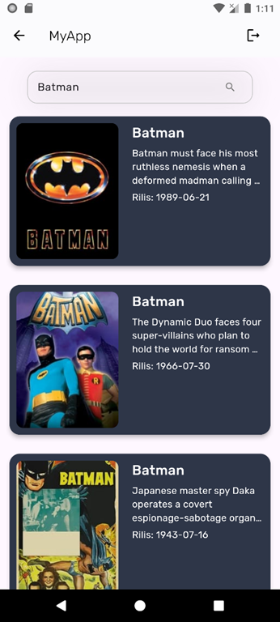

# Reckomov
for my bachelor degree final projects titled "Implemetasi The Movie DataBase Untuk Sistem Informasi Film Berbasis Mobile".

## Reckomov is a mobile app that uses The Movie Database (TMDb) API to provide detailed movie information.


## Features
- **Movie Details**: View synopses, cast, release dates, and more.

    

- **Search**: Find movies by title, genre, or other criteria.

    

- **User-Friendly UI**: Intuitive and responsive interface.

    

## Installation
1. **Clone the repository**
```bash
    git clone https://github.com/HowdyHowe/reckomov.git
```

2. **Navigate to project directory**
```bash
    cd reckomov
```

3. **Install dependency**
```bash
    flutter pub get
```

4. **Run the project**
```bash
    flutter run
```
